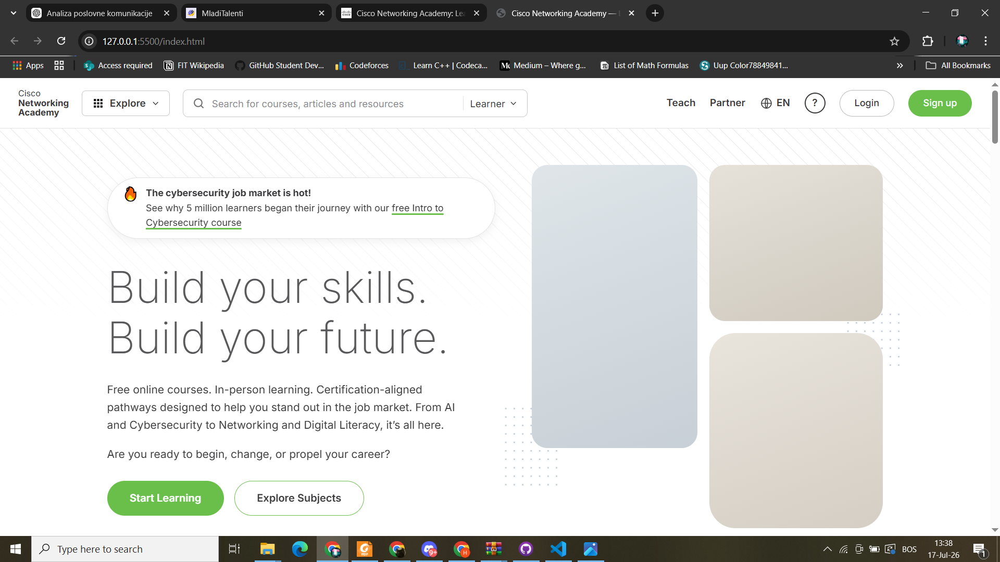
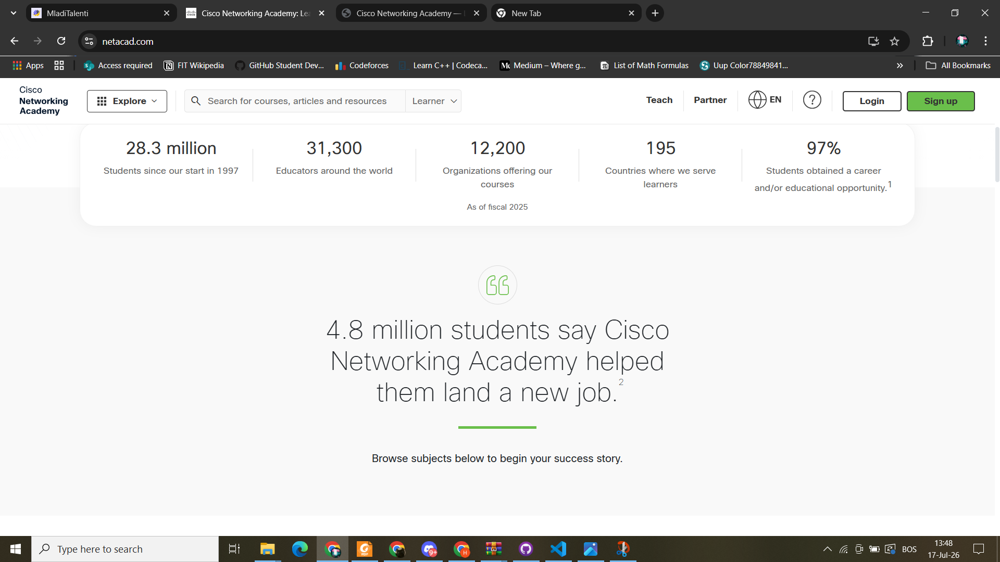
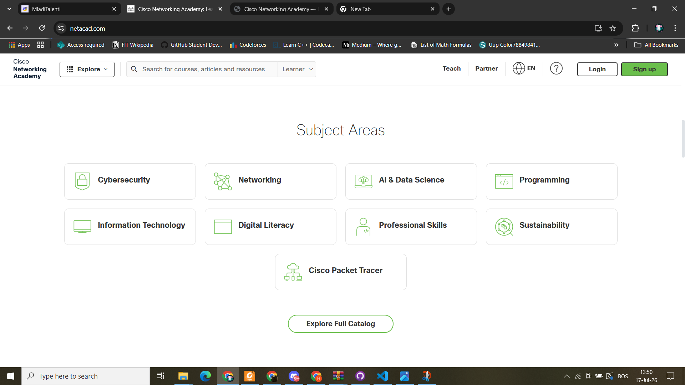

# NetAcad Landing Page — Recreation

A recreation of the [Cisco Networking Academy](https://www.netacad.com) landing page, built from scratch with pure HTML and CSS (no frameworks, no copied code). The goal of the exercise is pixel-level attention to spacing, typography, colors, and layout — on both desktop and mobile.

## Original vs. my version

| Original                                              | My recreation                                   |
| ----------------------------------------------------- | ----------------------------------------------- |
|  |  |
|    |    |

More screenshots:

### More NETACAD screenshots

**Hero section:**





**Courses section:**


### More CLONE NETACAD screenshots


## Tech

- HTML5 (semantic sections, inline SVG icons drawn by hand)
- CSS3 (Grid, Flexbox, custom properties, responsive breakpoints)
- ~7 lines of JS only for the mobile hamburger menu

## How to run

No install, no build step:

```bash
git clone https://github.com/ItsSelma/netacad-clone.git
```

Open `index.html` in your browser, or use the VS Code **Live Server** extension for auto-reload while comparing against the original.

## Notes

- All design tokens (colors, spacing, type weights) live at the top of `style.css` as CSS variables, tuned against the original using browser DevTools.
- Photos go in `images/` folder, I didn't add images, since I don't want anything that could cause some copyright in my repositories; if an image is missing, a neutral gradient placeholder is shown instead.
- The original uses the proprietary CiscoSans typeface; Inter (thin weights) is used as the closest freely available substitute.
- Educational project — the original design belongs to Cisco Systems, Inc.
